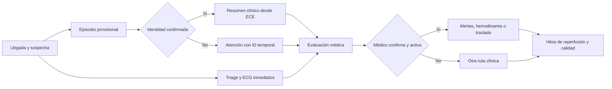

# Especificación de requerimientos de software
## Identificación del paciente y orquestación del Código Infarto

**Versión:** 1.1 — 17 de septiembre de 2026  
**Propósito:** documento de inicio para producto, arquitectura, desarrollo, integración, seguridad y validación clínica.  
**Material de origen:** las dos presentaciones `000 Biometría_en_el_Código_Infarto.pptx` y `000 Biometría_en_el_Código_Infarto (1).pptx` son idénticas (11 diapositivas, mismo SHA-256). Se añadió `000 Línea de Vida Digital Biométrica.pptx` (10 diapositivas).  
**Estado:** alcance funcional consolidado; la segunda presentación propone como sede piloto el Hospital Regional “Lic. Adolfo López Mateos” del ISSSTE. La autorización institucional, el ECE, el proveedor biométrico y la base jurídica se mantienen como decisiones por confirmar.

## 1. Resultado que debe entregar el producto

Construir una plataforma de urgencias que reduzca el tiempo administrativo de identificación de una persona con sospecha de infarto, recupere su información clínica cuando exista una correspondencia **confirmada**, apoye la activación y coordinación del Código Infarto por personal clínico y mida cada intervalo del proceso. Debe funcionar también cuando la persona esté inconsciente, carezca de documentos o teléfono, no exista coincidencia biométrica o falle una integración.

El piloto propuesto en la segunda presentación se ubica en **Admisión Central y Urgencias del Hospital Regional “Lic. Adolfo López Mateos” del ISSSTE**, con cinco puntos de control. Esta es una propuesta de la presentación y no una autorización o infraestructura confirmada por el hospital.

**Regla clínica invariable:** el triage, el ECG y la atención comienzan al llegar la persona. Nunca se bloquean por registro, derechohabiencia, biometría, consentimiento para World ID, conectividad ni disponibilidad del expediente. El protocolo del IMSS prioriza explícitamente síntomas de alarma aun sin identificación y pide ECG en los primeros 10 minutos; la activación del Código Infarto corresponde al médico tras interpretar el ECG e integrar el diagnóstico. [Protocolo IMSS](https://www.imss.gob.mx/sites/all/statics/profesionalesSalud/investigacionSalud/historico/programas/06-pai-codigo-infarto.pdf).

**Límite de identidad:** World ID demuestra humanidad y unicidad de forma anónima; no entrega nombre, expediente ni una función pública para identificar a un paciente inconsciente mediante un escaneo hospitalario. El flujo público requiere que la persona use su aplicación y comparta una prueba. Por tanto, World ID puede servir como factor voluntario **si previamente se vinculó con el identificador del paciente del hospital**. Para cumplir la promesa de reconocimiento en un paciente sin capacidad de participar se requiere validar, contratar e integrar otro mecanismo autorizado de identificación biométrica 1:N o depender del expediente provisional y conciliación posterior. Esta conclusión es una inferencia de las funciones publicadas por World. [World ID](https://world.org/world-id-app), [documentación de integración](https://docs.world.org/world-id/idkit/react).

## 2. Alcance y supuestos de implementación

### Incluido

- Entrada y triage por sospecha de infarto, registro temporal inmediato y reloj clínico.
- Identificación por métodos disponibles: identificador hospitalario, documentos, búsqueda supervisada y prueba biométrica autorizada; World ID cuando el paciente pueda participar y exista vinculación previa.
- Índice maestro de pacientes y prevención/corrección de duplicados y homónimos.
- Lectura contextual del expediente clínico electrónico (ECE) y escritura de eventos clínicos al sistema de registro autorizado.
- Activación médica, notificaciones, aceptación, escalamiento, coordinación de hemodinamia o traslado, y seguimiento de terapia fibrinolítica cuando corresponda.
- Bitácora, protección de datos, tableros y medición de tiempos.
- Integración configurable con sistemas hospitalarios, sistemas de calidad y plataformas KDS/MEG si se dispone de interfaces autorizadas.

### No se debe asumir como capacidad existente

- Un Orb instalado y operable en urgencias, acceso del hospital al código de iris o una API World ID de búsqueda 1:N.
- Que World ID proporcione identidad civil o una clave clínica universal.
- Que todas las instituciones compartan un ECE o un identificador nacional interoperable.
- Que el diagnóstico, la decisión de reperfusión o la disponibilidad de hemodinamia se puedan inferir del resultado biométrico.
- Tasas de error nulas, confidencialidad absoluta, mejora de 10 veces o tiempos clínicos garantizados; son hipótesis que se deben medir.

### Actores y permisos

| Actor | Capacidades principales |
|---|---|
| Recepción/vigilancia y triage | Marcar llegada, crear episodio provisional, registrar síntomas mínimos y derivar de inmediato. Sin acceso al expediente completo. |
| Enfermería | Registrar ECG y hitos, ver datos clínicos mínimos autorizados y confirmar recepción de tareas. |
| Médico de urgencias | Revisar identidad y resumen clínico, documentar interpretación del ECG, diagnóstico, estrategia y activar/cancelar Código Infarto. |
| Cardiología/hemodinamia | Recibir alerta, aceptar/rechazar disponibilidad, coordinar procedimiento y registrar hitos. |
| Traslados/ambulancia | Recibir datos mínimos y trazabilidad del traslado autorizado. |
| Admisión/gestión de identidad | Vincular, corregir, fusionar o separar registros siguiendo doble revisión para operaciones de alto impacto. |
| Calidad clínica | Ver métricas y casos seudonimizados; acceso identificable sólo si el rol y la finalidad lo autorizan. |
| Administración técnica/protección de datos | Configurar conectores, permisos, políticas, auditoría, retención y respuesta a incidentes; sin acceso clínico por defecto. |

## 3. Flujo operativo obligatorio

1. **Llegada:** primer contacto registra hora, sede y signos/síntomas de sospecha; crea un episodio único con identificador temporal y brazalete/etiqueta. Triage y ECG inician sin esperar una identidad definitiva.
2. **Resolución de identidad en paralelo:** se intenta la vía disponible. Un resultado puede ser `confirmado`, `provisional`, `sin_coincidencia`, `coincidencias_multiples`, `baja_confianza` o `proveedor_no_disponible`. Sólo `confirmado` habilita abrir automáticamente el expediente correspondiente.
3. **Paciente consciente con World ID:** si tiene su aplicación y un mecanismo de vínculo previamente validado con el índice hospitalario, autoriza una prueba; el servidor verifica la prueba y confirma ese vínculo según el protocolo vigente. Si falta teléfono, prueba, vínculo o una referencia de cuenta reutilizable admitida por World, se mantiene el episodio provisional y se continúa la atención.
4. **Paciente inconsciente o incapaz de participar:** la atención sigue con identificador temporal. Si existe un proveedor 1:N específicamente contratado, validado y autorizado, el sistema puede proponer candidatos; un profesional autorizado resuelve resultados ambiguos antes de abrir o unir expedientes. Si no existe, se usa búsqueda clínica supervisada y conciliación posterior. World ID, por sí solo, no cubre este caso.
5. **ECE:** con identidad confirmada, se recupera un resumen breve con alergias, medicamentos, problemas activos, antecedentes cardiovasculares, procedimientos relevantes y fechas/fuentes. Si no hay ECE o no hay identidad confirmada, se muestra claramente esa condición y se permite documentar la atención.
6. **Diagnóstico y Código Infarto:** el médico registra ECG interpretado, diagnóstico y hora cero clínica; activa el código. El sistema coordina y notifica a roles pertinentes, registra acuses, reintentos y escalaciones. El escaneo **no activa automáticamente** hemodinamia ni prescribe tratamiento.
7. **Reperfusión y cierre:** se registra la ruta elegida por el médico —angioplastia primaria, fibrinólisis, traslado u otra—, sus tiempos, cambios y desenlace; se concilia el episodio con el ECE y se genera información para calidad.

**Prerregistro fuera de la urgencia:** cuando la persona pueda decidir y exista el mecanismo técnico del proveedor, un operador autorizado localiza su registro en el índice hospitalario, verifica la identidad con los medios institucionales, explica el tratamiento de datos, solicita la prueba desde la aplicación de la persona y guarda sólo el vínculo permitido y la evidencia de autorización. Otro operador revisa las discrepancias. El vínculo puede revocarse o corregirse sin alterar la historia clínica. El prerregistro nunca es requisito para recibir atención.

**Estados independientes:** el episodio clínico pasa por `llegada → triage → evaluación/ECG → diagnóstico confirmado o descartado → código activo cuando corresponda → tratamiento/traslado → cierre`. El estado de identidad (`provisional`, `confirmada`, `en_conflicto`) cambia por separado y no detiene ninguna transición clínica. Cada cambio conserva actor, hora, motivo y estado anterior.

## 4. Requerimientos funcionales verificables

**Prioridad:** P0 = necesario para piloto seguro; P1 = necesario para operación integral y escala. Ningún P1 suspende la atención P0.

| ID | Prioridad | Requerimiento y criterio de aceptación |
|---|---|---|
| RF-01 | P0 | Registrar `arrival_at` en el primer contacto, sede, origen y usuario; el reloj clínico comienza aunque se desconozca el nombre. No se permite editarlo sin dejar motivo, valor anterior y auditoría. |
| RF-02 | P0 | Crear episodio provisional único en una acción, generar etiqueta/brazalete legible y evitar colisiones de identificadores aun sin conexión al ECE. |
| RF-03 | P0 | Capturar sospecha/triage y mostrar tareas urgentes de ECG; el flujo no obliga a llenar datos administrativos ni a verificar derechos antes de atender. |
| RF-04 | P0 | Registrar las horas de solicitud, adquisición, entrega e interpretación del ECG, cada una con responsable y fuente de hora. El sistema distingue “no realizado” de “no documentado”. |
| RF-05 | P0 | Integrar un servicio de resolución de identidad con estados explícitos y nivel/evidencia de correspondencia; nunca tratar una prueba de “humano único” como identidad civil. |
| RF-06 | P0 | Vincular previamente una referencia de cuenta/credencial que el proveedor permita verificar nuevamente con el `patient_id` interno mediante validación clínica/administrativa, base jurídica y auditoría. No se crean vínculos automáticos por semejanza de nombre. Si el proveedor no ofrece una referencia reutilizable segura, no se usará como llave de recuperación del ECE. |
| RF-07 | P0 | Para World ID, iniciar la prueba desde la aplicación del paciente, verificarla en backend según el SDK vigente, comprobar contexto/nonce/caducidad/uso único y probar que corresponde al vínculo local mediante mecanismo soportado por la versión desplegada. Una prueba de unicidad o un nullifier de un solo uso no basta para recuperar un expediente. Mostrar “sin vínculo” si no puede confirmarse esa relación. |
| RF-08 | P0 | Presentar un flujo manual supervisado para pacientes sin teléfono, sin World ID o incapaces de participar; jamás forzar el registro en World ID durante una crisis. |
| RF-09 | P0 para el piloto propuesto, bloqueador de factibilidad | Para identificar por biometría a un paciente inconsciente, integrar un proveedor 1:N autorizado. Evaluar por separado iris y rostro, las dos modalidades citadas en las presentaciones; habilitar sólo las que superen validación clínica, legal y de seguridad. Documentar captura, prueba de vida aplicable, falsos positivos/negativos, umbrales y ambigüedad. |
| RF-10 | P0 | Resolver 0, 1 o múltiples candidatos. Con múltiples/baja confianza se muestra sólo información mínima para conciliación autorizada; nunca se abre automáticamente un expediente clínico. |
| RF-11 | P0 | El índice maestro conserva identificadores por institución y su procedencia; soporta pacientes con nombres iguales, cambios de nombre, registros duplicados y vínculos revocados. |
| RF-12 | P0 | Permitir corrección, fusión y separación de episodios con motivo, evidencia, aprobación apropiada y reconstrucción de la historia de vínculos; se notifican los sistemas que recibieron la identidad equivocada. |
| RF-13 | P0 | Consultar el ECE sólo después de identidad confirmada o mediante acceso de emergencia justificado y autorizado por política local; limitar la respuesta a datos pertinentes y mostrar fecha, fuente y vigencia. |
| RF-14 | P0 | Mostrar alergias/reacciones, medicamentos relevantes, problemas activos, antecedentes cardiovasculares, intervenciones y alertas clínicas disponibles. Campos vacíos se rotulan “sin datos disponibles”, nunca “sin alergias” por defecto. |
| RF-15 | P0 | Registrar nuevos datos clínicos y enviar al ECE oficial sin duplicar notas; si la integración falla, encolar con identificador idempotente, indicar “pendiente de sincronizar” y reconciliar automáticamente/manual. |
| RF-16 | P0 | Médico autorizado registra diagnóstico, interpretación del ECG y `diagnosis_at`/hora cero clínica conforme al protocolo local; la biometría no genera diagnóstico. |
| RF-17 | P0 | Activar Código Infarto por acción explícita del médico, con episodio, diagnóstico, sede, estrategia inicial y prioridad; prevenir activaciones duplicadas y registrar cambios/cancelación. |
| RF-18 | P0 | Enviar alertas a roles configurados (urgencias, cardiología, hemodinamia, enfermería, traslados), recibir acuse, reintentar y escalar por falta de respuesta según tiempos configurados. Las notificaciones externas contienen datos mínimos. |
| RF-19 | P0 | Registrar disponibilidad y aceptación/rechazo de sala, equipo y ambulancia; si no hay capacidad, documentar escalamiento y traslado sin bloquear la atención. |
| RF-20 | P0 | Registrar la ruta clínica elegida: PCI, fibrinólisis, traslado o alternativa; hitos como orden, inicio, salida, llegada y reperfusión se capturan por personal clínico o interfaz autorizada. No se automatiza la selección terapéutica. |
| RF-21 | P0 | Mostrar temporizadores y avisos configurables para ECG, diagnóstico y reperfusión con origen de tiempo visible; una alerta nunca cambia el plan clínico ni retrasa la intervención. |
| RF-22 | P0 | Aplicar acceso por rol, sede, episodio y finalidad, con acceso de emergencia temporal (“break glass”) que exige motivo y revisión posterior. |
| RF-23 | P0 | Auditar toda lectura, consulta fallida, vinculación, cambio de identidad, activación, aviso, decisión clínica, exportación y acceso de emergencia con actor, hora, sede y correlación. |
| RF-24 | P0 | Registrar aviso, consentimiento o excepción legal aplicable al tratamiento de datos; permitir retiro/restricción cuando proceda sin borrar indebidamente el expediente clínico obligatorio. |
| RF-25 | P0 | Tablero operativo de casos activos: prioridad, hora de llegada, ECG, diagnóstico, estado del código, sala/traslado, identidad provisional/confirmada y fallos de integración. Actualización sin recarga manual. |
| RF-26 | P0 | Tablero de calidad con definición y exportación de tiempos por sede y periodo, incluyendo casos sin dato y cancelados; separar métricas clínicas de métricas de identificación. |
| RF-27 | P1 | Integrar sistemas de gestión de calidad y KDS/MEG mediante conectores de eventos autorizados y contratos específicos; no asumir acceso a sistemas mostrados sólo como ilustración en la presentación. |
| RF-28 | P1 | Configurar múltiples sedes, directorios de alertas, protocolos, recursos, metas, idioma, retención y conectores sin cambios en el código fuente. |
| RF-29 | P1 | Permitir referir/trasladar casos entre sedes con aceptación, conjunto mínimo clínico, cadena de custodia de la identidad y seguimiento del resultado. |
| RF-30 | P1 | Producir reportes de seguridad del paciente: identificación corregida, apertura de expediente incorrecto, duplicados, demoras, alertas no recibidas y eventos adversos relacionados con el sistema. |
| RF-31 | P0 | Configurar cinco puntos de control del piloto: cuatro estaciones de escritorio con lector ocular y una estación de alta concurrencia para iris/rostro, según el inventario propuesto. Identificar modelo, número de serie, ubicación, estado, calibración y operador; su compatibilidad y compra requieren prueba previa. |
| RF-32 | P0 | Crear un adaptador ECE para el ISSSTE sin escritura directa a tablas de la base original: consumir y publicar sólo las APIs autorizadas; exponer un contrato HL7 FHIR R4 si la capacidad y los perfiles reales del ECE lo permiten. Cada campo mapeado debe conservar su fuente y registrar errores de traducción. |
| RF-33 | P1 | Detectar posibles órdenes de laboratorio repetidas por paciente, episodio, prueba y ventana temporal configurable; mostrar orden/resultado previo y permitir que el clínico documente una repetición indicada. Nunca cancelar automáticamente una prueba por considerarla duplicada. |
| RF-34 | P1 | Cuando exista sistema de administración de medicamentos, verificar episodio/paciente en el punto de atención y reconciliar con la orden vigente antes de registrar la administración; ofrecer ruta de emergencia auditada si el identificador o sistema falla. |
| RF-35 | P0 | Producir evidencia verificable de hitos (ECG, diagnóstico, activación, acceso a hemodinamia y tratamiento) con registro sólo anexable, integridad criptográfica, firma/sello de tiempo y correcciones como nuevos eventos. Cualquier anclaje en blockchain requiere aprobación institucional y no debe publicar datos personales ni biométricos. |
| RF-36 | P1 | Medir ahorro y retorno con línea base, costos unitarios verificables, gastos recurrentes, tiempo de adopción y atribución causal; reportar por separado laboratorios repetidos evitados, tiempo de personal, papelería y estancias. |

### Pantallas mínimas para el primer diseño

| Pantalla | Información/acciones imprescindibles |
|---|---|
| Ingreso rápido y triage | Crear episodio, registrar hora de llegada y síntomas de alarma, imprimir etiqueta y ver indicación de ECG; usable sin nombre. |
| Identidad y conciliación | Estado de identidad siempre visible; iniciar método disponible, revisar evidencia/candidatos, confirmar o dejar provisional, corregir vínculo con permisos. |
| Resumen clínico | Alergias y medicamentos al frente, antecedentes pertinentes, fuente/fecha de cada dato y aviso destacado si ECE está inaccesible o la identidad no está confirmada. |
| Puesto del médico | ECG y cronología, registrar interpretación/diagnóstico, activar o cancelar código, elegir ruta clínica y documentar motivo. |
| Coordinación del código | Casos activos, avisos/acuse, estado de sala/equipo/ambulancia, temporizadores y escalamiento. |
| Hemodinamia/traslado | Aceptar o rechazar solicitud, informar disponibilidad, registrar hitos y comunicar cambio de plan. |
| Calidad y administración | Indicadores, casos incompletos, accesos de emergencia, auditoría, configuración de sedes, usuarios y conectores. |

## 5. Reglas de identidad y privacidad

1. El sistema usa un **identificador interno de paciente** y uno de **episodio**. No almacena un iris, una fotografía ni un “hash de iris” como si éste fuera identificador clínico universal. Un dato derivado vinculable con una persona se trata como dato personal.
2. El resultado World ID se interpreta como prueba de humanidad/tenencia de credencial dentro de la aplicación; la relación con un expediente se crea sólo mediante un vínculo hospitalario previamente validado **y técnicamente reutilizable**. La comparación facial 1:1 de World Face Auth tampoco sustituye la búsqueda 1:N de pacientes. World describe nullifiers de un solo uso en su evolución 4.0; por eso no debe suponerse que el valor recibido en una prueba sirva como identificador clínico persistente. [World ID](https://dev.world.org/world-id), [documento técnico de World](https://whitepaper.world.org/achieving-proof-of-human).
3. Una respuesta biométrica nunca basta para mostrar antecedentes de una persona si hay múltiples candidatos o dudas. Deben existir umbrales, supervisión humana y pruebas con población y condiciones reales del piloto.
4. En un paciente incapaz de confirmar su identidad, incluso un único candidato 1:N permanece **provisional** hasta aplicar la regla de corroboración aprobada por el hospital. Si la urgencia exige consultar un expediente candidato, se usa acceso de emergencia con señal visible de “identidad no confirmada”; no se fusionan episodios ni se escriben datos sobre ese expediente hasta resolver la identidad.
5. La aplicación hospitalaria no guarda imágenes crudas ni plantillas biométricas salvo que un diseño alternativo aprobado lo justifique expresamente. Incluso sin guardar imágenes, el vínculo y las trazas requieren protección.
6. El hospital define responsable, encargados, finalidad, aviso, base jurídica, transferencias, retención y procedimientos ARCO. En México aplica la ley de datos de **particulares** al responsable privado y la ley de **sujetos obligados** al responsable público; ambas tienen disposiciones de emergencia/asistencia sanitaria y controles para datos sensibles. La excepción de consentimiento para atención urgente no equivale a una autorización técnica para extraer identidad desde World ID ni elimina el deber de proporcionalidad. [LFPDPPP vigente](https://www.diputados.gob.mx/LeyesBiblio/pdf/LFPDPPP.pdf), [LGPDPPSO vigente](https://www.diputados.gob.mx/LeyesBiblio/pdf/LGPDPPSO.pdf).
7. Antes del piloto en sector público, protección de datos determina si corresponde evaluación de impacto y el trámite de la ley aplicable. Se documentan flujos hacia proveedores y ubicación de procesamiento.

## 6. Modelo mínimo de datos

| Entidad | Campos mínimos / regla |
|---|---|
| `Patient` / índice maestro | `patient_id`, identificadores externos con namespace y fuente, estado, historial de fusiones/separaciones. |
| `Encounter` | `encounter_id`, `patient_id` opcional, `temporary_id`, sede, llegada, salida, estado clínico y estado de identidad. |
| `IdentityEvidence` | proveedor, método, resultado, nivel de confianza, hora, operador, versión de algoritmo, referencia seudónima y caducidad; sin plantilla cruda en la aplicación. |
| `PatientBinding` | referencia de cuenta/credencial cuya verificación repetida esté soportada por el proveedor ↔ `patient_id`, método de validación, vigencia, revocación y aprobadores. No se usa un nullifier efímero como llave persistente. |
| `ClinicalSnapshot` | datos relevantes leídos del ECE, fuente, instante de lectura, versión y aviso de datos ausentes/caducos. |
| `InfarctCase` | episodio, sospecha, diagnóstico, estrategia, estado del código, médico responsable, tiempos y motivo de cancelación. |
| `ClinicalEvent` | evento tipado (ECG, diagnóstico, alertas, traslado, reperfusión), hora de ocurrencia, hora de registro, actor, sede y fuente. |
| `AlertDelivery` | destinatario/rol, canal, envío, acuse, reintentos, escalamiento y fallos. |
| `LegalBasisRecord` | aviso/consentimiento/excepción, versión, finalidad, fecha y responsable. |
| `AuditEvent` | actor, acción, recurso, resultado, motivo, hora y correlación; registro protegido contra alteración. |

Toda marca de tiempo se conserva en UTC con zona horaria y precisión del origen; la interfaz presenta hora local. El modelo guarda **hora de ocurrencia** y **hora de captura** por separado para no falsear indicadores por carga tardía.

## 7. Contratos de integración y arquitectura sugerida

Arquitectura modular: interfaz de urgencias y tablero; servicio de episodios; servicio de identidad/índice maestro; adaptador biométrico; adaptador ECE; orquestador de Código Infarto y notificaciones; bitácora/eventos; analítica. La fuente de verdad clínica seguirá siendo el ECE designado por cada institución. Los conectores deben ser reemplazables por sede.

### Interfaces mínimas a diseñar

| Interfaz | Operación / contrato |
|---|---|
| Entrada/episodio | Crear caso provisional de modo idempotente; consultar estado y actualizar hitos con control de versión. |
| Identidad | Solicitar verificación; recibir `confirmed`, `provisional`, `no_match`, `ambiguous`, `low_confidence`, `unavailable`; emitir evento de corrección de vínculo. |
| World ID | Solicitud firmada y prueba generada por el paciente; verificación en backend; resolución a `patient_id` sólo si existe un mecanismo de continuidad de cuenta soportado y probado, más vínculo previo y vigente. La versión exacta del SDK/API se fija en diseño técnico. |
| ECE | Buscar/leer `Patient` y `Encounter`, resumen clínico, guardar eventos/órdenes/notas; conocer capacidad real del ECE y manejar errores/reintentos. |
| Código Infarto | Crear/cancelar activación por profesional, publicar eventos a destinatarios, capturar aceptación, cierre y cambios. |
| Calidad | Exportar eventos y métricas seudonimizadas por API/event bus con catálogo y versionado. |

**Sobre interoperabilidad:** usar el estándar/catálogo exigido por la institución y por la NOM-024-SSA3-2012. Cuando el ECE lo soporte, mapear a HL7 FHIR (`Patient`, `Encounter`, `Observation`/`DiagnosticReport` para ECG según el origen, `Condition`, `ServiceRequest`, `Procedure`, `Task`, `AuditEvent`, `Provenance`). La versión de FHIR y los perfiles se pactan por integración; no se presupone que el ECE existente tenga una API FHIR. [NOM-024](https://dof.gob.mx/normasOficiales/4956/SALUD1/SALUD1.html), [HL7 FHIR](https://hl7.org/fhir/).

**Sobre el expediente:** conservar integridad, autoría, fecha/hora, trazabilidad y controles exigibles al expediente clínico, incluida la atención de urgencias. [NOM-004-SSA3-2012](https://sidof.segob.gob.mx/notas/docFuente/5272787).

**Contrato de evento común:** `event_id`, `schema_version`, `encounter_id`, `patient_id` opcional, `site_id`, `event_type`, `occurred_at`, `recorded_at`, `actor_id`, `source_system`, `correlation_id`, `payload` mínimo y `idempotency_key`. Toda operación de escritura debe tolerar reintentos sin duplicar casos, notas ni alertas.

## 8. Requerimientos no funcionales y criterios del piloto

| ID | Requerimiento medible |
|---|---|
| RNF-01 | La creación del episodio provisional y el acceso al triage funcionan 24/7 y aun cuando los proveedores de identidad/ECE estén caídos. Se prueba desconectando cada integración. |
| RNF-02 | Objetivo de la lámina: respuesta de identificación **menor de 5 segundos** para pacientes ya enrolados, con dispositivo y red disponibles. Medir p50/p95/p99 desde el inicio de la operación hasta el estado final; separar captura, proveedor, índice y ECE. Es meta de validación, no promesa clínica antes del piloto. |
| RNF-03 | Todos los fallos externos tienen timeout corto, mensaje visible, reintento controlado y ruta alternativa; ningún fallo deja la pantalla de urgencias bloqueada. |
| RNF-04 | Cifrado en tránsito y en reposo, llaves administradas, autenticación fuerte de personal, MFA donde proceda, privilegio mínimo, bloqueo de sesión y segregación por institución/sede. |
| RNF-05 | No incluir datos clínicos o biométricos en logs de depuración, analítica de producto ni avisos push; bitácora clínica separada de telemetría. |
| RNF-06 | Auditoría íntegra, respaldos y restauración probada, monitoreo de integraciones, alertas de incidentes y procedimientos de continuidad; RTO/RPO y disponibilidad contractual se fijan con la institución antes de producción. |
| RNF-07 | Interfaz táctil, legible bajo presión y con estado de identidad destacado; acciones críticas requieren identificación del actor y confirmación razonable sin añadir demoras peligrosas. |
| RNF-08 | Pruebas de seguridad, privacidad, usabilidad clínica y desempeño con volumen realista antes de habilitar biometría o activación automática de alertas. |
| RNF-09 | Configuración y datos separados por institución, versionado de APIs/eventos y despliegues reversibles; no mezclar expedientes entre sedes sin convenio y autorización. |
| RNF-10 | La segunda presentación plantea captura/identificación ocular en menos de 2 segundos. Medir por separado captura, comparación 1:N, confirmación humana, consulta al ECE y envío de alerta; sólo declarar cumplida la meta bajo condiciones y percentil acordados tras ensayo con hardware real. |

## 9. Indicadores y definición de éxito

1. **Tiempo llegada → ECG adquirido:** meta clínica a seguir conforme al protocolo local; el IMSS refiere ECG dentro de 10 minutos. No confundir con tiempo de interpretación/diagnóstico.
2. **Tiempo llegada → diagnóstico y hora cero clínica → activación:** reportar ambos intervalos; documentar el origen de hora cero según protocolo institucional.
3. **Tiempo llegada/diagnóstico → tratamiento:** separar PCI primaria, fibrinólisis y traslado. El protocolo IMSS describe rutas de angioplastia en menos de 90 minutos y fibrinólisis en menos de 30 minutos bajo sus condiciones; las reglas exactas de cálculo serán aprobadas por el comité clínico de la sede. [Protocolo IMSS](https://www.imss.gob.mx/sites/all/statics/profesionalesSalud/investigacionSalud/historico/programas/06-pai-codigo-infarto.pdf).
4. **Identidad:** porcentaje de confirmación, tiempo por método, sin coincidencia, múltiples, falsas vinculaciones confirmadas, correcciones y pacientes atendidos sin biometría.
5. **ECE y alertas:** disponibilidad/latencia, datos recuperados, accesos de emergencia, notificación entregada, acuse y escalamiento.
6. **Comparación con línea base:** antes/después por sede y turno, mismos criterios de inclusión; los “10x” y “cero errores” de las diapositivas sólo se aceptarán si los datos de piloto los demuestran.

## 10. Casos de aceptación de extremo a extremo

| Caso | Resultado exigido |
|---|---|
| CA-01 Paciente con sospecha sin identificación | Se crea episodio temporal; triage y ECG avanzan inmediatamente; no se pide World ID. |
| CA-02 Paciente consciente ya vinculado | Prueba World ID válida y aprobada por el paciente confirma vínculo local; se abre sólo su resumen ECE con fuente y fecha. |
| CA-03 Prueba World ID válida sin vínculo | Se muestra “humano verificado, expediente no vinculado”; no se abre ningún ECE. |
| CA-04 Paciente inconsciente | Triage/ECG y Código Infarto siguen con ID temporal; nunca se intenta una prueba World ID por el paciente. |
| CA-05 Dos candidatos biométricos/homónimos | Se bloquea apertura automática; personal autorizado concilia; cada intento queda auditado. |
| CA-06 Fallo de Orb/proveedor/red | Timeout visible y ruta alternativa; el reloj clínico continúa. |
| CA-07 ECE no disponible | Se documenta atención local; las escrituras quedan pendientes con reintento idempotente y posterior conciliación. |
| CA-08 Error de vinculación descubierto | Se separan registros, se preserva la trazabilidad y se notifica a responsables de los sistemas afectados. |
| CA-09 Activación clínica | Sólo médico autorizado activa; destinatarios reciben aviso, acusan y se escalan ausencias. |
| CA-10 Sin sala de hemodinamia | Se registra rechazo/capacidad y se ejecuta flujo de traslado o alternativa indicada por médico. |
| CA-11 Doble envío o usuario repetidor | No se crean dos episodios, alertas ni notas por el mismo `idempotency_key`. |
| CA-12 Auditoría y privacidad | Se reconstruye quién vio/cambió qué y por qué; no aparecen biométricos crudos ni datos clínicos en push/logs generales. |
| CA-13 Cinco puntos del piloto | Cuatro estaciones de escritorio y una de alta concurrencia reportan estado, ubicación, calibración y caída; ninguna caída bloquea urgencias. |
| CA-14 ECE sin FHIR nativo | El adaptador traduce datos de la API autorizada al contrato acordado o declara la incompatibilidad; no accede ni escribe directamente a tablas productivas. |
| CA-15 Orden de laboratorio potencialmente repetida | Se muestra el antecedente; el médico puede justificar y emitir una nueva orden sin cancelación automática. |
| CA-16 Administración de medicamento | Se evita registrar la dosis sobre un episodio diferente; la ruta de emergencia conserva motivo, actor y conciliación. |
| CA-17 Evidencia de hitos | Una modificación retrospectiva se detecta; la corrección agrega un evento; una verificación independiente reconstruye las marcas de tiempo. |

## 11. Entregables y fases

### Fase 0 — decisiones y prueba de factibilidad, bloqueadores para desarrollo integrado

1. Confirmar la autorización del Hospital Regional “Lic. Adolfo López Mateos” del ISSSTE propuesto como piloto y nombrar responsable clínico, responsable de datos, ECE, proveedor y ambientes de pruebas.
2. Obtener contrato/API y autorización de uso hospitalario de World ID si se exige la marca Orb; verificar personalmente en ambiente de pruebas qué prueba se obtiene, si permite reconocer de forma segura la misma cuenta en visitas distintas, latencia y dependencia de teléfono/cooperación.
3. Si se exige identificar pacientes inconscientes con biometría, seleccionar tecnología 1:N distinta o acuerdo técnico específico que demuestre esa capacidad; ensayar falsos positivos/negativos en urgencias.
4. Pactar el protocolo clínico local: qué pacientes entran, quién activa, cuándo empieza cada reloj, destinatarios y rutas PCI/fibrinólisis/traslado.
5. Levantar capacidades reales del ECE, índice de pacientes, sistemas de alertas y KDS/MEG; obtener sandbox, catálogos y contrato de interfaz.
6. Aprobar análisis de privacidad, seguridad, aviso, base jurídica, contratos y retención antes de usar datos reales.

### Fase 1 — validación clínica (MVP piloto)

Implementar RF-01 a RF-26 y RF-31, RF-32 y RF-35 con un ECE y una sede, usando datos de prueba hasta validación. Simular CA-01 a CA-14 y CA-17; medir línea base y latencias. World ID sólo entra en vivo si su flujo y vínculo fueron validados. Para el alcance del piloto descrito en la segunda presentación, RF-09 —identificar a un paciente inconsciente por biometría 1:N— es un requisito de factibilidad y aceptación, no una capacidad que se pueda presumir del Orb.

### Fase 2 — gobernanza e interoperabilidad

Integrar más sedes/ECE, RF-27 a RF-30, RF-33, RF-34 y RF-36, panel de calidad y acuerdos de intercambio; ajustar perfiles, catálogos, protocolos y evaluación de impacto por institución.

### Fase 3 — escala institucional

Desplegar progresivamente en redes públicas y privadas tras resultados clínicos y de seguridad, capacitación, soporte 24/7, acuerdos de datos y continuidad probada.

## 12. Decisiones pendientes que deben cerrar el dueño de producto y el hospital

| Decisión | Por qué bloquea o cambia el diseño |
|---|---|
| Confirmación del hospital ISSSTE propuesto y responsable institucional | Define aprobación formal, protocolo, usuarios, infraestructura y ley de sujetos obligados aplicable al piloto. |
| ECE, índice de pacientes y sus APIs | Determina acceso real al expediente y escritura de eventos; sin integración no existe el beneficio prometido. |
| Uso obligatorio de World ID/Orb y convenio técnico | Define si hay flujo voluntario verificable, hardware permitido, soporte, contrato y dependencia de teléfono. |
| Requisito de identificar a inconscientes por iris/rostro | No lo resuelve la integración pública de World ID; necesita proveedor/capacidad 1:N específica y validación. |
| Política de vinculación, umbrales y revisión humana | Controla el riesgo de mostrar el expediente de otra persona. |
| Rutas clínicas y metas locales | Define alertas, relojes, destinatarios, cambios de estado y medición. |
| Consentimiento/excepción, transferencias y retención | Determina los flujos de datos y despliegue legalmente admisible. |
| Disponibilidad y RTO/RPO contractuales | Determinan arquitectura, costo operativo, redundancia y soporte. |
| Fabricante/modelo/SDK de “Orbit” y lectores de los cinco puntos | Define si hay búsqueda 1:N real, integración USB, desempeño, tratamiento de biométricos y costo. |
| Relación contractual y técnica entre “Orbit” y World ID | La presentación mezcla los nombres; no se debe diseñar una única API hasta demostrar compatibilidad. |
| Uso o no de blockchain para hitos | Define infraestructura, operación, costo y revisión de integridad/valor probatorio. |
| Cotizaciones y periodicidad de licencias | El presupuesto de la diapositiva no indica proveedores vinculantes ni si SaaS se cobra anual o mensualmente. |

## 13. Trazabilidad con las 11 diapositivas

| Diapositiva | Necesidad cubierta |
|---|---|
| 1–2 | Propósito clínico y reducción de tiempo administrativo: secciones 1, 3, 9. |
| 3 | Triage y atención sin burocracia, tiempos de ECG/diagnóstico y homónimos: RF-01–04, RF-10–12. |
| 4 | Biometría, identificador y cero contacto: secciones 1–3, RF-05–09, reglas de privacidad. |
| 5 | Identidad + ECE + Código Infarto: RF-13–20 y flujo operativo. |
| 6 | Privacidad, cifrado, autenticación y marco jurídico: sección 5 y RNF-04–06. |
| 7 | Tiempo de registro, error, acceso y disponibilidad de datos: RF-25–26, RNF-02 e indicadores. |
| 8 | Línea temporal minuto 0/1/2/10/90: RF-01, RF-04, RF-16, RF-20–21 e indicadores; 1–2 minutos son hipótesis del piloto. |
| 9 | Arquitectura interoperable, ECE y sistemas de calidad KDS/MEG: secciones 7 y 11, RF-27–29. |
| 10 | Seguridad del paciente, eficiencia clínica y operativa: casos de aceptación e indicadores. |
| 11 | Piloto, gobernanza y escala nacional: sección 11. |

**Criterio de cierre del producto:** todas las rutas críticas funcionan con y sin identificación biométrica; ninguna vinculación incorrecta abre silenciosamente un expediente; el médico conserva la decisión clínica; los eventos se integran al ECE; se pueden medir y auditar los tiempos; y las dependencias de World ID, ECE y datos están aprobadas y probadas en la sede real.

## 14. Anexo del piloto ISSSTE propuesto: “Línea de Vida Digital Biométrica”

### 14.1 Alcance adicional de la segunda presentación

La segunda presentación nombra **“Orbit”** como sistema biométrico, propone el Hospital Regional “Lic. Adolfo López Mateos” del ISSSTE como sede, cinco puntos de control entre Admisión Central y Urgencias, cuatro lectores oculares USB de escritorio y una cámara dual iris/rostro de alta concurrencia. Propone un puente REST/HL7 FHIR R4 hacia el ECE existente, un registro criptográfico de hitos, formación para tres turnos, métricas operativas y un presupuesto de piloto.

**Separación técnica obligatoria:** “Orbit” no queda definido en las diapositivas por fabricante, modelo, SDK ni contrato. Tampoco hay evidencia de que los lectores USB presupuestados sean el **Orb de World ID** o compatibles con él. El Orb de World es hardware propio para emitir prueba anónima de humanidad, y sus flujos públicos dependen de la aplicación del titular; un lector comercial de iris/rostro requiere su propio motor y contrato para buscar pacientes en un índice clínico. Son dos integraciones distintas hasta que una demostración técnica pruebe lo contrario. [Orb de World](https://world.org/blog/world/orb-faqs), [World ID](https://world.org/world-id-app).

El puente FHIR R4 debe construirse sobre interfaces **autorizadas por el ISSSTE**. “No alterar bases de origen” significa no escribir directamente en las tablas del ECE; la documentación de la atención sí debe llegar a su sistema oficial por API permitida o por un proceso de conciliación aprobado. El gateway no debe inventar datos faltantes ni ocultar la procedencia del dato traducido.

Si el hospital aprueba el componente blockchain de la propuesta, éste se ejecuta **después** de registrar el hito clínico, de forma asíncrona: ancla únicamente una huella de un evento canónico firmado, guarda comprobante y permite verificarla más tarde. La falta de red, confirmación o servicio blockchain no retrasa ECG, alertas ni tratamiento. El ECE y la bitácora institucional siguen siendo las fuentes operativas.

### 14.2 Cifras y promesas que el piloto debe comprobar

| Afirmación de las diapositivas | Tratamiento en el requerimiento |
|---|---|
| Escaneo ocular `< 2 s` e identificación “instantánea” | Meta de prueba de hardware y motor 1:N con cronometraje y percentil definido. Captura, comparación, confirmación y apertura del ECE se miden por separado. |
| “Cero riesgo”, “error cero”, precisión `99.999%` y FAR `< 0.0001%` | No son garantías de seguridad del paciente. El proveedor debe entregar metodología y resultados independientes; el hospital mide falsos positivos, falsos negativos y fallos de captura con sus pacientes y condiciones. |
| Registro tradicional `12–20 min` y reducción del `84%` | Hipótesis de línea base. Medir desde el mismo inicio y fin del proceso, por turno y condición; no extrapolar la mejora del registro a todo el recorrido clínico. |
| Arribo a tratamiento `120 min → < 60 min` | Resultado clínico por validar, estratificado por ruta de reperfusión, gravedad y capacidad de sala; el software sólo puede contribuir y registrar los tiempos. |
| `18.5%` de estudios de laboratorio duplicados | Requiere auditoría local que distinga repetición innecesaria de una repetición médicamente indicada. RF-33 previene duplicados potenciales sin suprimir órdenes clínicas. |
| Blockchain “inmutable” como blindaje jurídico | Implementar primero evidencia íntegra y verificable; decidir uso de blockchain y valor probatorio con informática, seguridad, archivo y área jurídica. No publicar datos clínicos o biométricos en una cadena. |
| Reducción de estancias y ahorro de papel | Medir con costos marginales, grupos comparables y atribución definida; no adjudicar automáticamente al escaneo resultados multifactoriales. |

La biometría es probabilística incluso en sistemas avanzados; World también documenta errores de comparación. [Whitepaper técnico de World](https://whitepaper.world.org/achieving-proof-of-human).

### 14.3 Presupuesto que figura en la presentación, sin cotización validada

| Concepto del piloto | Cantidad | Rango presentado (MXN) |
|---|---:|---:|
| Lectores oculares USB de escritorio | 4 | $48,000–$96,000 |
| Cámara dual iris/rostro | 1 | $36,000–$70,000 |
| Integración API y middleware con ECE | 1 desarrollo | $70,000–$100,000 |
| Licencia de motor biométrico SaaS | Hasta 10,000 registros | $30,000–$60,000 |
| Capacitación y soporte en sitio | 80 horas, 3 turnos | $24,000–$40,000 |
| **Total aritmético de la presentación** | | **$208,000–$366,000 + IVA** |

Este cuadro es **un supuesto comercial de la diapositiva**, no un presupuesto de mercado ni una oferta de proveedor. La licencia SaaS podría ser gasto recurrente; la periodicidad no está indicada. Antes de aprobar una cifra se requiere cotización por modelo y servicio, impuestos, instalación, licencias recurrentes, soporte 24/7, red, seguridad, respaldo, mantenimiento, consumibles, reposición, integración real del ECE y costo de auditoría/registro criptográfico.

La presentación proyecta $150,000–$300,000 MXN/año en laboratorios, más de $500,000 en estancias y $45,000–$80,000/año en papelería, con recuperación en 6–8 meses. **No incluye la línea base ni la fórmula de atribución**, y no aclara si todos esos ahorros son independientes o realizables en el primer año. El tablero financiero debe calcular `beneficio neto mensual = ahorros validados − licencias − operación − soporte − mantenimiento` y `payback = inversión inicial / beneficio neto mensual`, con escenarios y supuestos visibles. No publicar un ROI hasta contar con datos locales y costos completos.

### 14.4 Plan de implantación propuesto y condiciones de salida

| Periodo de la presentación | Entrega verificable |
|---|---|
| Antes de semana 1 | Aprobación formal del hospital, responsables, acceso de prueba al ECE, elección de hardware/motor, evaluación de privacidad, protocolo clínico y línea base de tiempos/costos. |
| Semanas 1–2: conectividad y TI | Red y cinco ubicaciones verificadas; adaptador API/FHIR probado con datos sintéticos; pruebas de falla sin interrumpir el ECE. |
| Semanas 3–4: capacitación | Personal médico, enfermería y admisión de los tres turnos practica escenarios normales, inconsciente, ambigüedad, caída de sistemas y acceso de emergencia. |
| Semanas 5–8: operación piloto | Casos reales sólo tras autorización; seguimiento diario de latencia, seguridad de identidad, ECG, activación, disponibilidad ECE y eventos adversos. |
| Semana 9 en adelante: evaluación | Comité clínico, informática, seguridad y protección de datos revisa resultados; expansión condicionada a metas, incidentes y costo neto observados. |

Los contactos ARIANE/SYSCOM mencionados en la diapositiva final son **candidatos para demostraciones físicas**, no proveedores seleccionados ni prueba de compatibilidad. Pedirles ficha de equipo, SDK/API, arquitectura 1:N, metodología de error, soporte, procesamiento de datos, certificaciones pertinentes y cotización vinculante antes de decidir.

### 14.5 Trazabilidad de la segunda presentación

| Diapositiva | Requerimiento o decisión incorporada |
|---|---|
| 1 | Sede ISSSTE propuesta, cinco puntos y aprobación institucional: secciones 1, 11 y 14. |
| 2 | Línea base de retrasos, trazabilidad y costos: RF-23, RF-26, RF-36 y sección 14.2. |
| 3 | Captura iris/rostro, menos de 2 segundos, privacidad y tasas de error: RF-09, RF-31, RNF-10 y sección 14.2. |
| 4 | Arquitectura edge, gateway REST/FHIR R4, ECE y evidencia criptográfica: RF-32, RF-35 y secciones 7 y 14.1. |
| 5 | Reducción de espera, acceso a ECE y alerta a hemodinamia: RF-13–21 e indicadores; resultados numéricos por validar. |
| 6 | Marco RADAR-Salud: indicadores de atención, tecnología, ineficiencias, ahorro y rentabilidad en secciones 9 y 14.3. |
| 7 | Cinco componentes y presupuesto del piloto: RF-31 y sección 14.3. |
| 8 | Ahorros, ROI y payback: RF-33, RF-36 y sección 14.3. |
| 9 | Fases de semanas 1–9+: sección 14.4. |
| 10 | Levantamiento técnico, presupuesto y demostraciones: decisiones de sección 12 y condiciones de sección 14.4. |
